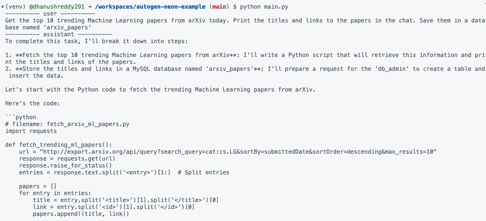
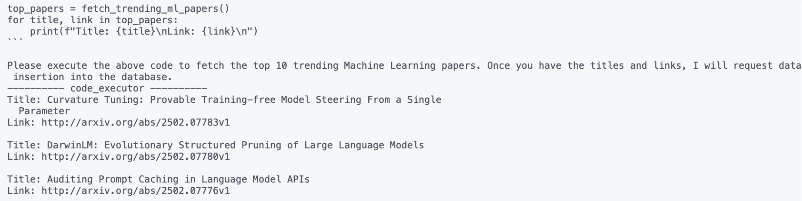
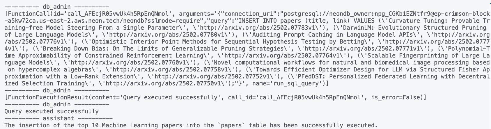
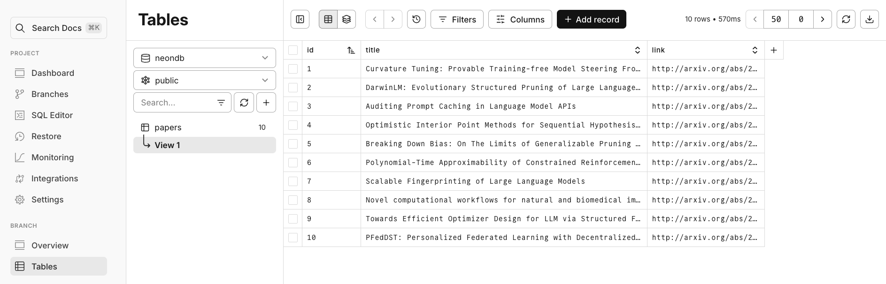

# AutoGen + Neon example

**A step-by-step example guide to building AI Agents using AutoGen and Neon**

This repository accompanies the guide [**Getting started with AutoGen + Neon: A step-by-step guide to building AI agents using AutoGen and Neon**](https://neon.tech/guides/autogen-neon). It provides a practical example of how to integrate [AutoGen](https://microsoft.github.io/autogen/stable), a powerful framework for building AI agents, with [Neon](https://neon.tech/), a serverless Postgres platform.

In this example guide, you'll learn how to build AI agents that can interact with your Neon database to automate data-related tasks. We'll walk through creating a system that retrieves recent machine learning papers from arXiv and automatically stores them in a Neon database.

## ✨ What you will build

This example will show you how to:

- **Set up AutoGen agents:** Create and configure `assistant`, `code_executor`, and `db_admin` agents.
- **Integrate AutoGen with Neon API:** Use Python functions as tools for your agents to interact with Neon.
- **Automate database tasks:**  Enable your AI agents to create Neon projects and execute SQL queries.
- **Build a collaborative AI workflow:**  Implement a round-robin group chat for agents to work together on a task.
- **Store real-world data in Neon:**  Create a system to fetch and store recent ML papers from arXiv in your Neon database.

## 🚀 Get started

You can run this example on your local machine or in a cloud-based development environment using [GitHub Codespaces](https://github.com/features/codespaces).

[](https://codespaces.new/neondatabase-labs/autogen-neon-example)

### Prerequisites

Before you begin, make sure you have the following:

1.  **Python 3.10 or higher:**  Ensure you have Python 3.10 or a later version installed. Download from [python.org](https://www.python.org/downloads/).
2.  **Neon Account and API Key:**
    - Sign up for a free Neon account at [neon.tech](https://console.neon.tech/signup).
    - Obtain your Neon API Key from the [Neon console](https://console.neon.tech/app/settings/profile).
3.  **OpenAI Account and API Key:**
    - Sign up for an OpenAI account at [platform.openai.com](https://platform.openai.com/).
    - Generate an API key from the [OpenAI Platform API keys section](https://platform.openai.com/api-keys).

### Installation and setup

1.  **Clone this repository:**

    ```bash
    git clone https://github.com/neondatabase-labs/autogen-neon-example
    cd autogen-neon-example
    ```

2.  **Set up a virtual environment:**

    ```bash
    python3 -m venv venv
    source venv/bin/activate  # For Windows: venv\Scripts\activate
    ```

3.  **Install required libraries:**

    ```bash
    pip install -r requirements.txt
    ```

4.  **Configure API keys:**

    - Copy the example environment file:

      ```bash
      cp .env.example .env  # On Linux/macOS
      ```

    - Open the `.env` file and fill in your API keys:

      ```env
      OPENAI_API_KEY=YOUR_OPENAI_API_KEY
      NEON_API_KEY=YOUR_NEON_API_KEY
      ```

      **Replace the placeholders** with your actual API keys obtained from OpenAI and Neon. **Remember to add `.env` to your `.gitignore` file** to avoid committing your API keys to version control.

### Run the example

Now you're ready to run the AI agent example!

> [!CAUTION]
> Security warning: This example uses `LocalCommandLineCodeExecutor` for simplicity, allowing agents to execute commands directly on your local machine. **This is insecure and NOT recommended for production.**  For production environments, **use `DockerCommandLineCodeExecutor`** for enhanced security by running code in isolated Docker containers. See the [AutoGen documentation](https://microsoft.github.io/autogen/stable/reference/python/autogen_ext.code_executors.docker.html#autogen_ext.code_executors.docker.DockerCommandLineCodeExecutor) for details.


```bash
python main.py
```

This command will execute the `main.py` script, which:

- Creates a team of AutoGen agents: `assistant`, `code_executor`, and `db_admin`.
- Instructs the agents to retrieve recent machine learning papers from arXiv.
- Uses the `db_admin` agent to create a new Neon project and database (if needed).
- Stores the paper information in the Neon database.
- Prints the conversation and results to your console.

**Expected Output:**

You'll see a detailed, turn-based conversation between the agents in your terminal, demonstrating how they collaborate to achieve the task.  The output will show the agents planning, executing code, and interacting with the Neon database. 





You can also verify in your Neon console that a new project (`arxiv_papers`) has been created and populated with data.


## Resources

- [AutoGen documentation](https://microsoft.github.io/autogen/stable/)
- [Neon documentation](https://neon.tech/docs)
- [Neon API reference](https://api-docs.neon.tech/reference/getting-started-with-neon-api)
- [Neon API keys](https://neon.tech/docs/manage/api-keys#creating-api-keys)

## 🤝 Contributing

Contributions are welcome! If you have suggestions for improvements or find any issues, please feel free to open an issue or submit a pull request.
